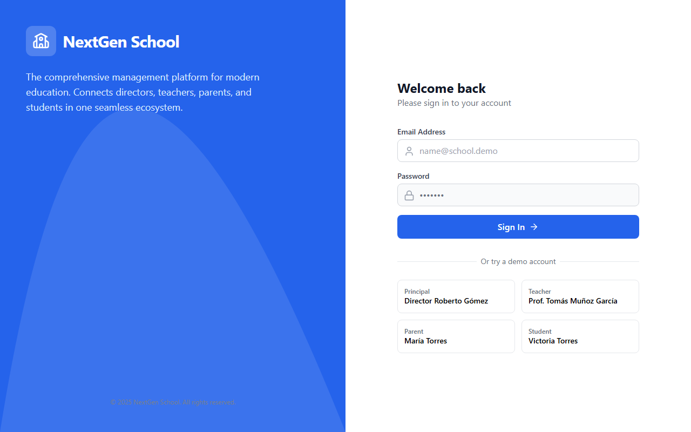

<div align="center">

</div>

# NextGen School Dashboard (Antigravity Edition)

A modern, role-tailored School Management System that transforms the educational experience for Students, Parents, and Teachers.

## 🚀 What We Built

We replaced the traditional, clunky school software with a suite of high-performance dashboards:

### 1. 🎓 Student Dashboard ("Antigravity UI")
Designed to engage.
- **Glassmorphism & Mesh Gradients**: A modern, app-like feel.
- **Gamified Elements**: Grade cards and progress tracking.
- **Widgets**: "Up Next" Class Timeline, Homework Manager, and Weekly Schedule.

### 2. 👪 Parent Dashboard ("Student Hub")
Visibility and peace of mind.
- **Multi-Child Support**: Seamlessly switch between children.
- **Smart Analytics**: Attendance donut charts and performance trend indicators.
- **Quick Actions**: One-click "Justify Absence", "Contact Tutor", or "Download Report".

### 3. 👨‍🏫 Teacher Dashboard ("Command Center")
Operational efficiency.
- **Class Analytics**: Real-time KPIs (Class Average, Students at Risk).
- **Smart Gradebook**: Heatmap visualization for grades, inline editing, and quick filters ("Needs Attention" vs "Outstanding").

## 🛠️ Tech Stack
- **Framework**: React 19 + TypeScript (Vite)
- **Styling**: Tailwind CSS + HeadlessUI
- **Analytics**: Tremor (React Library)
- **Testing**: Vitest (Unit) + Playwright (E2E)
- **Icons**: Lucide React

## 📦 How to Run

1. **Install dependencies**:
   ```bash
   npm install
   ```
2. **Start the App**:
   ```bash
   npm run dev
   ```
3. **Run Tests**:
   ```bash
   npx vitest run     # Unit Tests
   npx playwright test # E2E Tests
   ```
